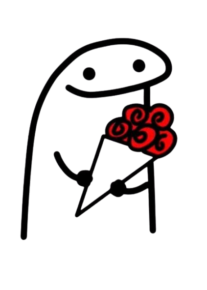

# 💘 Pedido de Date Especial

<div align="center">
  
  
  [](https://github.com/4ndre-silva/pedido-namoro/stargazers)
  [](https://github.com/4ndre-silva/pedido-namoro/network/members)
  [](https://github.com/4ndre-silva/pedido-namoro/blob/main/LICENSE)
</div>

## 🌟 Sobre o Projeto

Um pedido de date digital interativo e divertido! Este projeto web foi criado para tornar seu pedido de date mais especial e memorável. Com um design romântico e elementos interativos, você pode surpreender aquela pessoa especial de uma forma única e criativa.

### ✨ Destaques

- 🎯 Botão "Não" que foge do cursor do mouse
- ✨ Fundo animado com partículas (tsParticles)
- 🎉 Efeito de confete colorido ao aceitar
- ✍️ Efeito de digitação no texto (Typewriter Effect)
- 💝 Design romântico e moderno
- 📱 Interface totalmente responsiva
- 🎨 Personalização fácil
- ⚡ Performance otimizada

## 🛠️ Tecnologias

- HTML5
- CSS3 (Variáveis CSS e Animações)
- JavaScript (Vanilla JS)
- [tsParticles](https://particles.js.org/) para o fundo animado
- [Canvas Confetti](https://www.npmjs.com/package/canvas-confetti) para efeitos de confete

## 🚀 Começando

### Pré-requisitos

- Um navegador web moderno
- Git (opcional, para clonar o repositório)

### Instalação

1. Clone o repositório
```bash
git clone https://github.com/4ndre-silva/pedido-namoro.git
```

2. Entre na pasta do projeto
```bash
cd pedido-namoro
```

3. Abra o arquivo `index.html` em seu navegador

## 🎨 Personalização

### Cores e Estilos

Personalize as cores e estilos editando as variáveis CSS em `style.css`:

```css
:root {
    --primary-color: #431172;
    --secondary-color: #EDC65A;
    --text-color: #EDC65A;
    /* outras variáveis */
}
```

### Imagens

- Substitua `images/florks-date.png` para alterar a imagem principal exibida após aceitar.
- A imagem de fundo repetida é definida no CSS (`style.css`) no pseudo-elemento `body::before`. Substitua `images/seu-padrao.png` (ou o nome que você usou) pelo caminho da sua imagem.

### Textos

Edite os textos no arquivo `index.html`:

```html
<h1>Aceita ter um datezinho comigo?</h1>
<!-- ... -->
<p id="typewriter-text" class="typewriter"></p>
<!-- O texto digitado é definido no script.js -->
```

O texto que aparece após clicar em "Sim" está definido no arquivo `script.js` dentro da função `typeWriter` ou onde ela é chamada no evento de clique do botão "Sim". Procure por algo como:

```javascript
typeWriter("Seu novo texto aqui!", typewriterText);
```

## 📱 Responsividade

O projeto é totalmente responsivo e funciona perfeitamente em diversos dispositivos e tamanhos de tela, incluindo smartphones (iPhone, Samsung, Xiaomi, Redmi), tablets (iPad) e computadores (PC, Mac, Notebook).

## 🤝 Contribuindo

Contribuições são sempre bem-vindas! Sinta-se à vontade para:

1. Fazer um Fork do projeto
2. Criar uma Branch para sua Feature (`git checkout -b feature/AmazingFeature`)
3. Commit suas mudanças (`git commit -m 'Add some AmazingFeature'`)
4. Push para a Branch (`git push origin feature/AmazingFeature`)
5. Abrir um Pull Request

## 📝 Licença

Este projeto está sob a licença MIT. Veja o arquivo [LICENSE](LICENSE) para mais detalhes.

## 👨‍💻 Autor

**André Silva** - [@4ndre-silva](https://github.com/4ndre-silva)

## ⭐ Agradecimentos

- Inspiração para o design
- Comunidade open source
- Todos os contribuidores
- As bibliotecas tsParticles e Canvas Confetti

---

<div align="center">
  Feito com 💖 por André Silva
</div> 
